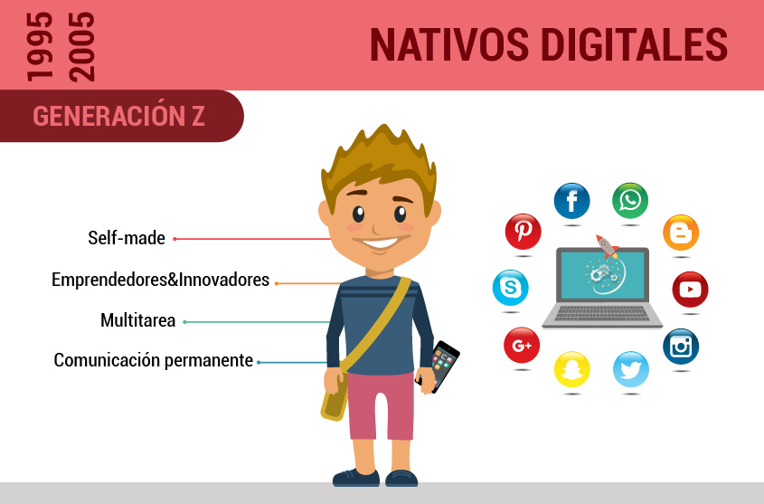
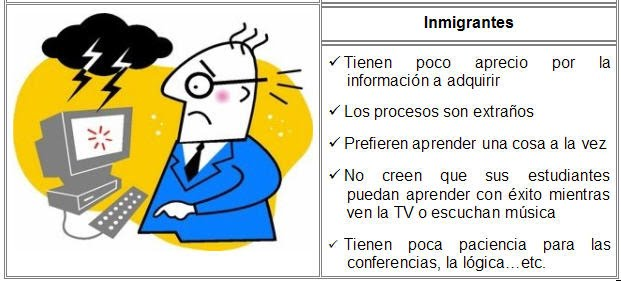
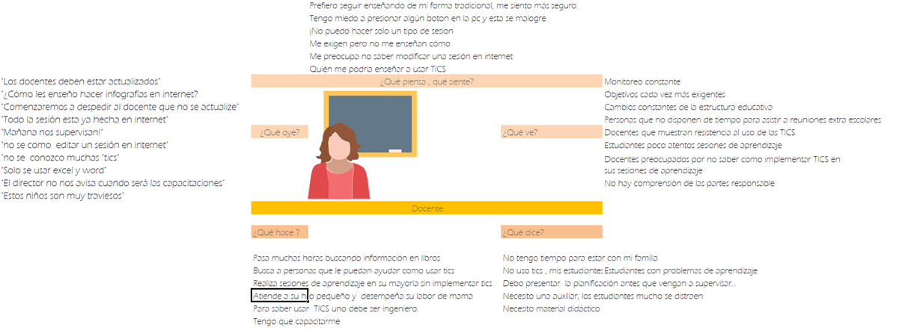

# RED SOCIAL EDUTECH ("Compartiendo nuestras mejores experiencias en Tecnología y Educación ")
## Preámbulo
Las tecnologías de la Información y Comunicaciones TICS son las nuevas innovaciones tecnológicas. En la actualidad son de gran importancia en la educación ya que a través de ellas se han desarrollado nuevas estrategias del aprendizaje dentro de los diversos Entornos Virtuales, asi mismo las TIC son usadas a diario por los Nativos Digitales(Prensky describe a los nativos digitales como las personas que, rodeadas desde temprana edad por las nuevas tecnologías ),convirtiendo a las TICS en  herramientas indispensables para el desarrollo de sus actividades conditianas, sin embargo se puede notar en los  docentes considerados como inmigrantes digitales  las situación cambia pues no incluyen estas TICS en la planificación y desarrollo de sus sesiones de aprendizaje ,privandose  de los beneficios que se obtiene del uso adecuado de las mismas, para el desarrollo de las inteligencias múltiples de sus estudiantes, por el cual, la razón principal de esta Red Social Edutech es asociar las buenas experiencias que han ido obteniendo los inmigrantes digitales con las estrategias o métodos eficacez  que  a diario ejercen los docentes para transmitir sus ideas,pues según la encuesta y entrevistas realizadas , inmigrantes digitales consideran que es muy importante para ellos aprender nuevas formas de transmitir sus ideas de manera efectiva y consideran que sería interesante obtener estos tips de personas especialistas en estas facetas de educación.Logrando asi con EDUTECH  disminuir la notable brecha que existente entre los docentes y las TICS y al mismo tiempo beneficiar a los usuarios de tics para una mejor o efectiva comunicación con personas de su entorno.
Referencias :
https://www.oei.es/historico/divulgacioncientifica/?Alumnos-nativos-digitales-docentes-migrantes-digitales
https://www.iebschool.com/blog/nativos-digitales-digital-business/
https://www.huffingtonpost.es/2014/12/02/tecnologia-inteligencias-multiples_n_6248634.html

## LO MEJORCITO DE LAS REDES SOCIALES 
# FACEBOOK
Facebook con más de 2.000 millones de usuarios activos mensuales. Actualmente, podemos interactuar a través de perfiles personales (que identifican a cada persona como usuario) y páginas (orientadas a organizaciones de cualquier índole).

El perfil muestra la personalidad, los intereses y cómo es la vida online de cada persona. Entre las actividades más comunes que realizan los usuarios de Facebook son compartir fotos, música, vídeos, noticias y opiniones sobre infinidad de temas.

Por su parte, las páginas sirven para promocionar productos, organizaciones o figuras públicas. Una página no “pide ser tu contacto o amigo”, sino que una recibe admiradores, seguidores y partidarios de lo que se están proponiendo o dando a conocer (“me gusta”).

Finalmente, los grupos son creados por usuarios que desean reunir a personas alrededor un tema común. A diferencia de un perfil, donde los contactos son tus amigos y conocidos, en un grupo se pueden sumar personas de diferentes partes y que no se conocen. Pueden ser públicos, privados o secretos.

# TWITTER
Es el servicio de microblogging más extendido en el mundo, con más de 320 millones de usuarios activos mensualmente. Twitter permite a usuarios y empresas conectarse con la información que consideran interesante a través del envío y recepción de “tweets”, mensajes de no más de 280 caracteres que se publican en el perfil de la persona que los escribe, y se replican simultáneamente en la página de inicio de sus seguidores. Por si no visualizas el proceso, seguir a un usuario es algo así como suscribirse a sus tweets.

Twitter incorpora la capacidad de búsqueda por usuario, tema, hashtag y enviar mensajes directos – DM-, privados a nuestros otros usuarios. Además, incorpora la posibilidad de tweets y perfiles patrocinados, una manera no invasiva de publicidad que se adapta a los intereses de los seguidores.

# INSTAGRAM
Caracterizada por la forma cuadrada de las imágenes en honor a la Kodak Instamatic y las cámaras Polaroid, es una aplicación gratuita para compartir fotos en la que los usuarios pueden aplicar efectos tipográficos como filtros, marcos, colores retro y vintage adquirida por Facebook en 2012. Actualmente, cuenta con más de 800 millones de usuarios

# LINKEDIN
Fundada en 2003, LinkedIn se ha convertido en la red social profesional de referencia.  Cada día capta aproximadamente 60.000 nuevos perfiles y su ritmo de crecimiento mundial ha sido vertiginoso, hasta sobrepasar los 500 millones de usuarios. De hecho, muchas empresas la utilizan hoy en día como una de las principales herramientas de reclutamiento gracias a sus amplias posibilidades y la completa información que poseen del candidato.

# YOUTUBE
Creado por tres antiguos empleados de PayPal en febrero de 2005, en noviembre de 2006 fue adquirida por Google a cambio de 1.650 millones de dólares, convirtiéndose así en su adquisición más cara hasta entonces. Desde ese momento, el impacto de YouTube en la Web 2.0 no ha hecho más que crecer, convirtiéndose en la principal plataforma de subida y visionado de videos, así como el segundo buscador por volumen de consultas, sólo superado, paradójicamente, por el propio Google.

# GOOGLE PLUS
Impulsada inicialmente para competir con Facebook, Google Plus se ha convertido en una interesante plataforma que integra los servicios clásicos de Google, así como funcionalidades nuevas e interesantes como el sistema de videoconferencia conocido como Hangout. Al igual que su competidor, Google Plus permite tener presencia a los usuarios a través de tres modalidades: perfil personal, página o comunidad (esta última sería el equivalente a los grupos de Facebook). Además, otro de los aspectos interesantes que la han definido es su importancia cada vez mayor en las estrategias SEO de las organizaciones, ya que no debemos olvidar que Google es el principal motor de búsqueda en Internet, y Google Plus su aplicación social.

# PINTEREST
Pinterest es una red social basada en imágenes en la que las personas crean vínculos a través de sus intereses. En ocasiones se describe esta plataforma como un “tablero de corcho online” en el que los individuos van colgando elementos gráficos que llaman su atención. De ahí su nombre ‘Pin + interest = Pinterest’ (“Pinear” tus intereses). Esta red no está basada tanto en la interacción con otras personas como ocurre en otras redes sociales como Facebook o Twitter, sino que se centra más en los intereses o aficiones que las unen.

# FLICKR
Adquirida por Yahoo! en 2.005, es uno de los mayores repositorios de imágenes del mundo, con más de 10.000 millones. Al igual que en el caso de YouTube, para crear una cuenta en Flickr no se requieren conocimientos avanzados, sino tan sólo una cuenta de correo electrónico. Una vez activa, podemos subir una o varias imágenes, crear álbumes, seguir a otros usuarios o incluso subir videos.

# VIMEO
Criado a la sombra de YouTube, Vimeo es una plataforma audiovisual de streaming online que permite subir y compartir contenidos. Centrada en ofrecer un servicio de calidad, suele ser utilizada por profesionales del ámbito audiovisual para volcar sus portfolios o sus productos. Además, ofrece opciones interesantes para empresas o proyectos que precisen de un sistema profesional de almacenamiento de video.

Referencia: 
Esta información fue extraida de la siguiente fuente :https://thesocialmediafamily.com/redes-sociales/

## Introducción

EDUTECH es una comunidad de Inmigrantes Digitales y Educadores, donde ambos lados se benefician compartiendo sus buenas experiencias respecto al uso de las  TICS como tambien aprendiendo nuevas estrategías o técnicas de enseñanza para transmitir sus ideas  de forma eficaz.Beneficiando así a ambas partes.

## Objetivos
 
 *Disminuir la brecha existente entre los docentes y el uso de las TICS
 *Agenciar a los Nativos digitales sobre estrategias o técnicas para lograr el aprendizaje.

## Definición del producto:
  ¿ Cuáles son los elementos básicos que tiene una red social?

  1. Rendimiento de la comunidad
      -KPI relevantes
      -Benchmarking interno y competitivo
      -Analisis cualitativo

  2. Desempeño de compromiso
      -Análisis cuantitativo
      -Segmentación

  3. Rendimiento del contenido
    - Contextualización

Referencias :
https://blog.digimind.com/en/agency/proving-roi/the-3-essential-elements-of-a-successful-social-media-report/

  
* Quiénes son los principales usuarios de producto.
 -Nativos Digitales :
 Los nativos digitales enfocan su trabajo, el aprendizaje y los juegos de nuevas maneras: navegan con fluidez; tienen habilidad en el uso del ratón; utilizan reproductores de audio y video digitales a diario; toman fotos digitales que manipulan y envían; y usan, además, sus ordenadores para crear videos, presentaciones multimedia, música, blogs, etc. Absorben rápidamente la información multimedia de imágenes y videos, igual o mejor que si fuera texto; consumen datos simultáneamente de múltiples fuentes; esperan respuestas instantáneas; permanecen comunicados permanentemente y crean también sus propios contenidos. A los nativos digitales les encanta hacer varias cosas al mismo tiempo: son multitarea.
  
 -Docentes considerados Inmigrantes digitales 
 Las características de los Inmigrantes digitales son: Estructuras mentales moldeadas por los procesos paso a paso. Resolver un problema a la vez. Actuación basada en el análisis deductivo. Aprendizaje basado en conocimientos pre-adquiridos. Los migrantes digitales son mas relajados y les gusta entablar una conversación con una persona y para pasar a otra terminan la anterior
  
      
* [ ] Cómo descubriste las necesidades de los usuarios.

Se descubrieron las necesidades de nuestro público objetivo a travéz de los procesos de diseño Design Thinking 
Nos apoyamos en encuestas, entrevistas y mapas de empatía, continuación se detalla las necesidades decubriertas a través de Mapa de Empatía.
Las entrevistas se hicieron de forma virtual con los docentes, por medio de video llamadas , pero capturando al mismo tiempo el audio de nuestros público objetivo.

  

* Mapas de empatía 1 Nativos Digitales
    
* Mapas de empatía 2 Docentes
    

* ¿Qué problema resuelve el producto para estos usuarios?

Con la implementación de nuestra Red Social EDUTECH  buscamos resolver dos problemas:
 1.Disminuir la brecha notoria y existente entre nuestros Docentes considerdados como Inmigrantes Digitales  y uso de las TICS en su práctica docente.
 2.Agenciar de estrategias de aprendizaje a los Nativos Digitales, que según nuestra encuesta consideraron muy importante  el adoptar estas estrategias en su vida cotidiana.

* Cuáles son los objetivos de estos usuarios en relación con el producto.

Docentes Inmigrantes Digitales : 
Poder acceder a nuestra Red Social EDUTECH y poder encontrar posts sobre buenas experiencias que han adquirido los Nativos Digitales al hacer uso de las TICS.Permitiendo así elegir al docente que herramienta podría considerar en la planificación de sus sesión de aprendizaje.

Nativos Digitales : 
Su objetivo es poder visualizar posts, sobre las  estrategias más efectivas que los docentes usan para poder transmitir sus mensajes a sus estudiantes, tips sobre ello,de preferencia  a través de imágenes  de preferencia.

Estos datos  anterior mente descritos fueron obtenidos despues de realizar las encuestas y entrevistas con nuestro público objetivo.

*  Cuáles son las principales funcionalidades del producto y cuál es su prioridad.

* [ ] Cómo verificaste que el producto les está resolviendo sus problemas.
* [ ] Cómo te asegurarás que estos usuarios usen este producto.
* [ ] Benchmark de las principales redes sociales.
* [ ] Resumen de entrevistas con usuarios.
* [ ] Link/screenshots del prototipo de alta fidelidad.
* [ ] Conclusiones de testing con el prototipo de alta fidelidad con usuarios.
* [ ] Conclusiones de testing con el producto en HTML.
### UX

Desde el punto de vista de UX, deberás:  

* Hacer un _benchmark_ de las principales redes sociales.
  

* Hacer al menos 2 o 3 entrevistas con usuarios.

* Hacer un prototipo de alta fidelidad.
* Testear el prototipo con usuarios.
* Asegurarte de que la implementación en código siga los lineamientos del
  diseño.
* Hacer sesiones de testing con el producto en HTML.

#### 1) Definición del producto

En el `README.md` debes colocar cómo conociste el mercado de las redes sociales, cómo descubriste las necesidades de los usuarios, y cómo llegaste a la definición final de tu producto. Si tienes fotos de entrevistas, cuestionarios y/o sketches
(bocetos) compártelos. Es importante que detalles:

* Cuáles son los elementos básicos que tiene una red social.
* Quiénes son los principales usuarios de producto.
* Cómo descubriste las necesidades de los usuarios.
* Qué problema resuelve el producto para estos usuarios.
* Cuáles son los objetivos de estos usuarios en relación con el producto.
* Cuáles son las principales funcionalidades del producto y cuál es su prioridad.
* Cómo verificaste que el producto les está resolviendo sus problemas.
* Cómo te asegurarás que estos usuarios usen este producto.

Para poder llegar a estas definiciones te recomendamos revisar: benchmarks, entrevistas con usuarios y tests de usabilidad.
